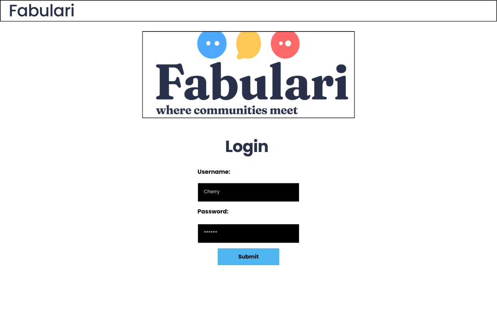
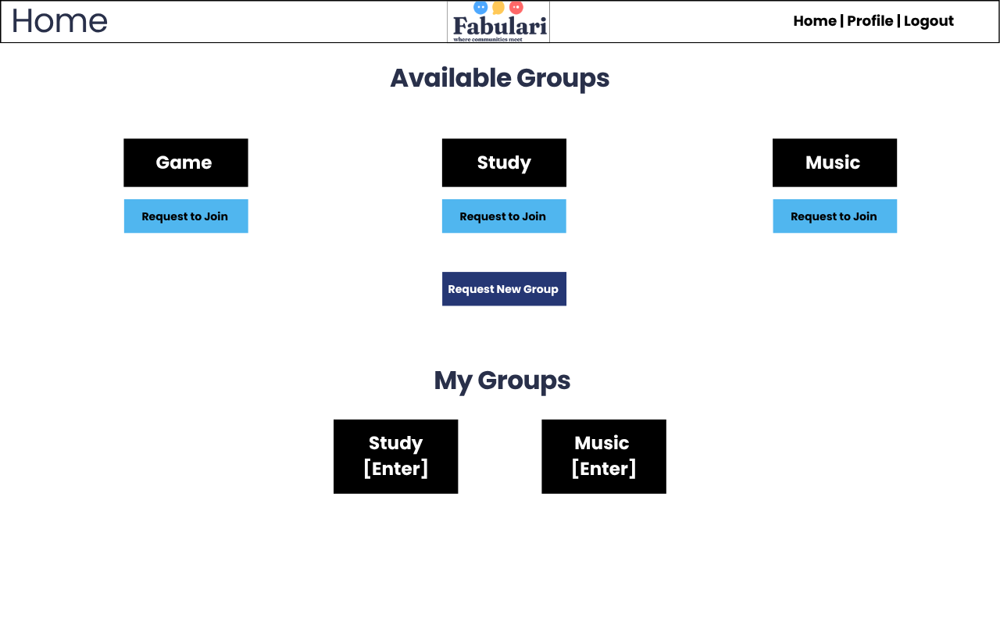
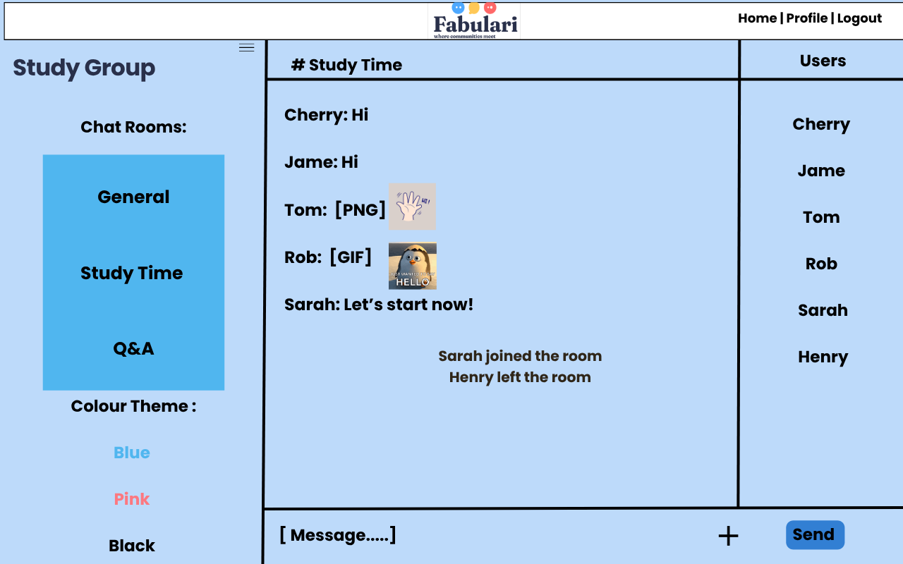
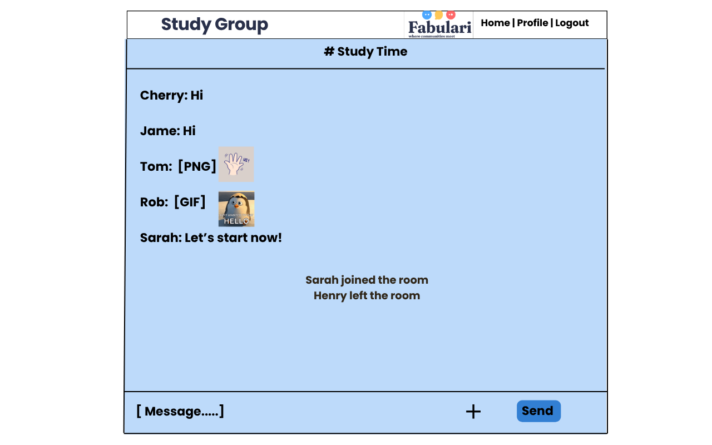
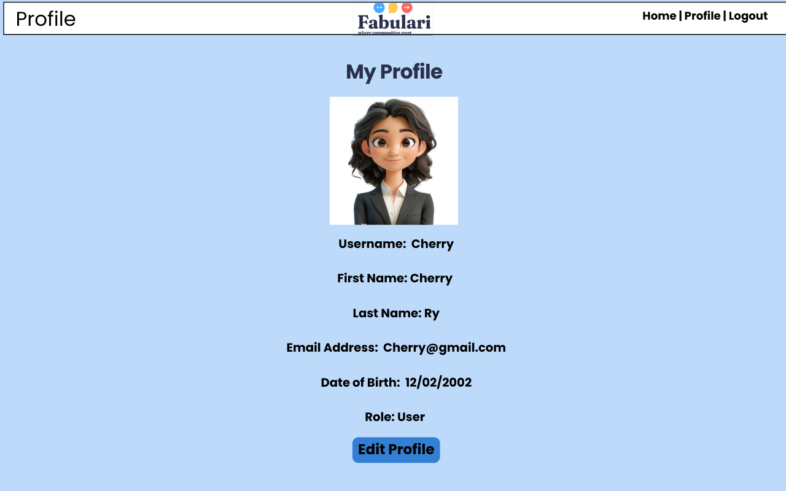
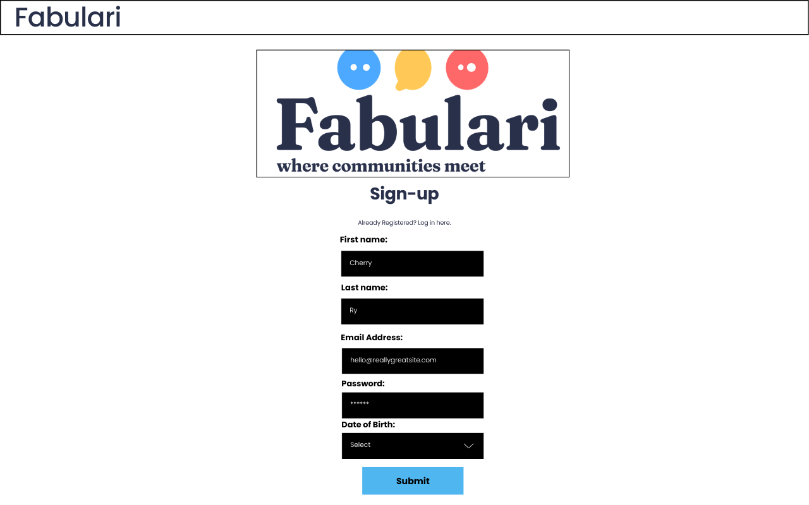
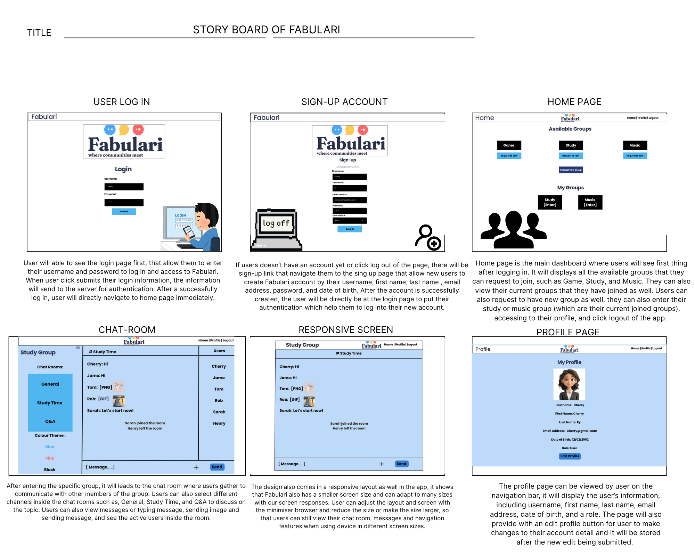

# 3813ICT Full Stack Development
## Phase 1 - Specification, Design and Prototype

**Name:** Sovannsocheata Rith  
**Student Number:** s5395943

## 1. Project Overview

The aim of this project is to implement and design the full-stack chat application that allows users to communicate with others through chat rooms and entering specific groups. The chat includes real-time text messages and images. Users are able to join the groups and interact with others in the room that are available for them. 

The application system itself will consist of three different roles of the users permission, such as regular users, group administrators, and a super administrator. These are the roles that will help to provide access and approval to the functions, which are groups, users requests, user management, chat rooms management, and more to the administrative actions.

The technology of the application will be using MEAN stack. Mongo, Express, Angular (20+), Node.js. Whereas, other functionality will be using Socket.io to develop a real-time chat communication accessibility for the functionality of the application.
## 2. Git Strategy 

During the development of my solution for the Fabulari application, GIT will be applied as the control system. The completed versions of the project will be created by the stable main branch. Different branches will be separate for different features for the project structures, such as documentation of the project, UI design, front end, and backend development.

With every pieces of work being created, fully completed, or changes from every sections, the commit will help to commit our work regularly. It will show commit messages to keep record of the history throughout the process of the development. When the work on the branch has been completed, finalised, and being tested, the git will help to merge it into the main branch.

The GitHub will be a part of the repository for the project and, it will create a repo for the project that includes the pushes of changes made in project. It will be private to the creator and the collaborator that has all access to the histories of our development process for the project. 
## 3. Specifications and Assumptions

### 3.1 Functional Requirements
| ID | Role | Functional Requirement |
|---|---|---|
| FR01 | User | A user can login to the application with their username and password input. |
| FR02 | User | A user can request the creation of a new group and they should provide the required details in the request (age limit, colour theme, submit title, description).| 
| FR03 | User | User can request to join a group through sending a message request to the group admin, and they can view the available groups.|
| FR04 | User | Users can enter many groups as they want, or be a member of multiple groups. |
| FR05 | User | Users are able to enter the chat rooms if they are a member of that group,by the approval age access. If they can't enter the room, it means the users are not qualify for the age limit to be able to enter the chat room. |
| FR06 | User | Users can only send and recieve text messages in real-time in the chat. |
| FR07 | User | Users can only send and recieve the images in PNG or GIF.|
| FR08 | User | Users can see the five previous messages on the chat screen after entering the chat room.|
| FR09 | User | There will be a notification that will load when another user joins in or leaves the room, and it will notify all users in the chat room. | 
| FR10 | User | Users can see who else is in the chat room. |
| FR11 | Group Admin | A Group Admin will handle and manage the details of the group such as, name, description, colour theme, and the minimum age limit. |
| FR12 | Group Admin | Group Admin can create chat rooms within a group. |
| FR13 | Group Admin | Group Admin can make changes or editing their chat room's details that have been created by them.|
| FR14 | Group Admin | Group Admin also can delete or remove the chat rooms of their group. |
| FR15 | Group Admin | A Group Admin can view the approved request members or members that are allowed to be in the group and a banned users of the group. |
| FR16 | Group Admin | A Group Admin can add and remove members from their group. |
| FR17 | Group Admin | A Group Admin can ban a regular user from their group. |
| FR18 | Group Admin | A Group Admin can also approve or reject the user's requests who wants to join their group too. |
| FR19 | Group Admin | A Group Admin can also promote a user in that group to become another admin because in a group, they can have multiple group admins. As well as, if the inital group admin wanted to leave their role as an admin, they will promote another user from that group to be the admin instead. |
| FR20 | Group Admin | A Group Admin can send a request message to remove the user from the entire system with provided reason to the super admin, in order for the super admin to remive them entirely from the system. |
| FR21 | Group Admin | A Group Admin can also ask permission and request the super admin to delete the group as well. |
| FR22 | Super Admin | The super admin will receive and review the requests from the users that asked to creat a new group. |
| FR23 | Super Admin | After the approval of user's group request, the super admin can create a new group for the user. |
| FR24 | Super Admin | Super admin can assign the first user who requested to create the group to be the first initial group admin. |
| FR25 | Super Admin | The super admin can also get the requests from the group admin in order to ban or remove the users from the entire system.|
| FR26 | Super Admin | The super admin have the ability to remove user from the entire system. |
| FR27 | Super Admin | Super admin can also get a request message from the group admins to make a group deletion process.|
| FR28 | Super Admin | Super admin also have the access to view which accounts have been permanently banned from the system as well.|
| FR29 | Super Admin | The super admin can view by look through and search for all the audit logs that contains the history of every action inside the system, such as users being removed or created and added to groups. |
| FR30 | System | System itself will create the initial super admin by using a bootstrap process when there is no users exist in the system yet.|
| FR31 | System | Once the super admin is being created, the bootstrap process in the system will not run again. |
| FR32 | System | Based on the age limit which is the minimum age set for the group, will make the system restrict the group membership and users who do not meet the minimum age requirement will not allow to join the group. |
| FR33 | System | In other case, if the group admin increases the group's minimum age, the members that are in that group who are below that new minimum age will be removed immediately from the group. |
| FR34 | System | Inside the group, it can have more than one chat rooms. Which mean it can have unlimited number of chat rooms and it can also be none as well.|
| FR35 | System | The colour theme will apply to the group and the chat rooms as well once it is selected. |
| FR36 | System | The system can only support the image and text interaction in the chat, but it won't support the video or voice interaction.|
| FR37 | System | System will display the five previous messages that left in the chat room for users who enters the chat room to see what was previously the conversation were about. |
| FR38 | System | The system will make the users to view who currently active in the chat room by the notification message of which users enter and left.|
| FR39 | System | System will give users a notification in the chat room when user joins or leaves the room with their name. |
| FR40 | System | System will record all important history of the administrative actions in the audit logs. |
| FR41 | System | The group admin cannot be left without the administrator, so in the group must have at least one group admin. |

### 3.2 Assumptions and Clarifications

Client have clarified that the group member should have a minimum age limit. So, the restriction for minimum age will be applied to the group membership level. However, in another requirement it says that the minimym age is applying to the individual chat rooms, will this be apply to group and chat rooms as a whole? Further clarification will be discussed. 

The minimum age requirement is being applied to everyone and all users are able to view all available groups, even if their age does not meet the age requirement. Therefore, even if they can see every groups availble, they can't join the group if their age are not meeting the required age in that particular group.

A group can have multiple Group Admins, but it must always have at least one Group Admin. If the only Group Admin wants to leave or be removed, another group member must first be promoted to Group Admin. In every group, they can have multiple group admins. At least one group admin should appear  in the group. Unless the group admin wants to leave or ebing removed, they can assign another group memeber in that chat room and the group to be an admin/group admin. 

The super admin will not have the ability to chat or to interact and joining groups, it is a system adminstration that will only be there to approve and see the logs inside the system. 

Client also mentioned that the users who are inside the chat room can see users who are currently present or active in that room and will recieve a notifications whenever users join or leave that group. Group admins can also view the allowed and banned users of the group. However, this needs more clairifcation because it was not clear that if the regular users can also view the full list of all group members in the chat and group or not. 

## 4. Data Structures

The data structures will contain the relevant information required for the system. Below are the properties (user, group, chat room, message, requests, and audit logs) and data types for each structure, including a description of what each property represents.

### 4.1 User

- id (Number): Every user need to have their identification with a unique ID that represent the user themselves.

- username (String): User will need to create their username to identify who are they. 

- email (String): User will put their email address.  

- firstName (String): User will put in their first name.

- lastName (String): User will put in their last name. 

- age (Number): User will enter their age number and this will allow the system to check with the age requirement.

- password  (String):  User will enter their encrypted password.

- role (String): The system will display the role for user as regular user or group admin. 

- groups  (Array): Groups that the user joins.

### 4.2 Group

- id (Number): A number or identified ID for the group. 

- name (String): The title or name of the group.

- description (String): Group's topic or a specific content/background description about the group.

- minimumAge (Number): Inside the group, there will be a minimum age limit that requires for the user to enter in order to join group.

- themeColour (String): There will be colour theme being selected by the user for the group that also connects to the chat rooms.

- admins  (Array): In the group, there will be a list of group admins.

- members (Array): There will be a list of members of the group which are the regular users that is part of that group.

- bannedUsers (Array): The banned users will also have a list of name from that group.

- chatRooms (Array): A list of chat rooms belonging to the group. There will be lists of the chat rooms that are belonging to that group.

### 4.3 Chat Room

- id (Number): There will be an ID number of that chat rooms.

- name (String): The chat room will also have a name or topic.

- groupId (Number): In the chat room there will be an ID of the group that the chat belongs to.

- activeUsers (Array): Chat room will have a lists of members or users that are currently in the chat room.

- messages (Array): There will be messages that are from the chat room in a list. 

### 4.4 Message

- id (Number): There will be an ID number for every messages, system will recognise which message.

- roomId (Number): The chat room ID will display and represent which room the message was sent from. 

- userId (Number): It will contatin the user ID to define who sent that message. 

- content (String): The content of the message or the text message itself. 

- image (String): If there is an image attached, the filename of the image will displayed.

- timestamp (Date): Timestamp will evidence with the correct real date and time of the message sent.

### 4.5 Request

- id (Number):  An ID that reprsent the request message. 

- type (String): The request type will have variety of requests such as creating groups, group membership, removing a group or removing a user.

- senderId (Number): Sender ID will help to identify the person who send the reuqest which can be a userID or a group admin. 

- receiverId (Number): Receiver ID will identify as the group admin or a super admin who are receiving the request.

- details (String): The request will comes with the reason and information about the request.

- status (String): The request message will also have status showing whether it is approved or rejected, and pending. 

- timestamp (Date): The real date and timestamp will be appear, showing when the request was being submitted or sent. 

### 4.6 Audit Log

- id  (Number): The ID number will help to identify the audit log being recorded.

- userId (Number): User ID will appear for every actions they create in the system.

- action (String): An action and information or description of the action being recorded or occurred.

- timestamp (Date):The date and real-timestamp of the action occurred. 

 ## 5. Angular Architecture

In addition, Angular architecture will show the structure of the frontend of the application. Below are the components, services, and routes that determine each purpose that will be used for the application's functions. 

 ### 5.1 Components

-  LoginComponent: The component will shows the login form that allow the users to enter their username and password. 

- SignupComponent: This component will show the sign-up form that allows new users to create new account.

- ProfileComponent: This component will show the information of the current user or the person logging in.

- HomeComponent: This component will show the main page which is the home dashboard for the user and the available groups. 

- GroupsComponent: Group component will allow users to view all the availbale groups and make a request to join. It will show the available groups on screen as well.

- ChatRoomComponent: The chat room component will show user with the selected chat room that include in with messages, users that are active in the chat, there will be notification of the people who join and leave the room.

- MusicChatComponent: This component will show the music group chat room with messages from other memebers, active users, channels with topic, and the available music chat rooms.

- GroupAdminComponent: Group admin component will gives the interface that help them to manage their group, chat rooms, and the memebers.

- SuperAdminComponent: Super admin also provides the interface that will help managing and handling the administrative side, which are users, group, audit logs, and the requests. 

### 5.2 Services

The following services are planned for the further development of the application:

- AuthService: Auth service will manage the authentication: login and logout. 

- UserService: Handles user information and user-related requests to the server. User service will handle the information of the user and requests that are from the user to the server. 

- GroupService: Group service will help managing the group member requests, group information, and management. 

- ChatService: Chat service will handle the messages and the chat room information.

- HttpClient: HttpClient is currently used in the Angular components that communicate with the Node.js and Express REST API.

### 5.3 Routing

- /login (LoginComponent): Login component will shows the login page. 

- /signup (SignupComponent): The sign-up route will show the account registration page.

- /home (HomeComponent): The routing of home component will appear in the main page of the home dashboard right after the user login.

- /groups (GroupsComponent): The groups route will shows the available groups on the page for user to view.

- /profile (ProfileComponent): The profile route will show the information of current users.

- /chat-room (ChatRoomComponent): The chat-room route will show the Study group chat room.

- /music-chat (MusicChatComponent): The music-chat route will show the Music group chat room.

- /groups/:groupId/rooms/:roomId (ChatRoomComponent): The chat room route will shows the selected chat room of that particular group user selected. 

- /group-admin/:groupId (GroupAdminComponent): There will be management page for the group admin. 

- /super-admin (SuperAdminComponent): The system interface will display a system administrative for super admin to do its job there.

- / redirects to /login: When the application first opens, it will redirect the user to the login page.

## 6. Server-Side API Endpoints

Server-Side API Endpoints allow the frontend and the backend server to work together and communicate with each other. Below are the HTTP methods and their endpoints that will apply to the use of making request, create, update, and remove any data in the app.

### 6.1 Proposed Endpoints

- POST  /api/login: The purpose of the login POST is to check the details of the user's login and authenticate them. 

- GET  /api/users: The users GET will read the existing data of the user, allow the app to request and recieves user's detail stored by the server. 

- POST  /api/users: The users POST will create new account for the user. 

- GET  /api/users/:id: The users GET will recieves the details of that user.

- PUT  /api/users/:id: Updates the details of a specific user. The PUT users will help updating the user's details. 

- DELETE  /api/users/:id: DELETE will help to delete or remove the user from the system. 

- GET  /api/groups: Retrieves the available groups. Groups GET will receive the available groups.

- POST  /api/groups: Creating new group by using groups POST. 

- GET  /api/groups/:id: Getting the information about the specific group from using groups GET.

- PUT  /api/groups/:id: PUT groups will help to updating the information about the group. 

- DELETE  /api/groups/:id:  DELETE will help to delete the group.

- GET  /api/groups/:groupId/rooms:  Getting all the chat rooms that belongsd to the group and getting information of that chat room.

- POST  /api/groups/:groupId/rooms:  POST will help to create a new chat room for the specific group.

- PUT /api/groups/:groupId/rooms/:roomName: The PUT updates the name and also the details of that specific chat room.

- DELETE /api/groups/:groupId/rooms/:roomName: Deleting a specific chat room from a group.

## 7. Design Documents

In the following wireframes and story boards, we will demonstrate the navigation of the Fabulari application and the user interface of the app. The design will be in a responsive layputs for every screen sizes.

### 7.1 Login Page

### 7.2 Home and Groups Page

### 7.3 Chat Room - Desktop Layout

### 7.4 Chat Room - Responsive Layout

### 7.5 Profile Page

### 7.6 Sign-up Page

### 7.7 Storyboard

Fabulari storyboard depicts the main navigation in the application. Users will begin at the login page to log into the account and access to the app. User can also navigate to Sign-up page to create new account and once the user is signed in, it will navigate the user to log in. After logging in, users are directed to the home page, which they can view all the available groups and their current joined groups. From the home page, users will see the navigation bar on top of the screen and it allows them to access to home, profile and logout. Users can also access to their study and music chat rooms from the home page. When logging out, the users will return to the login page. 

